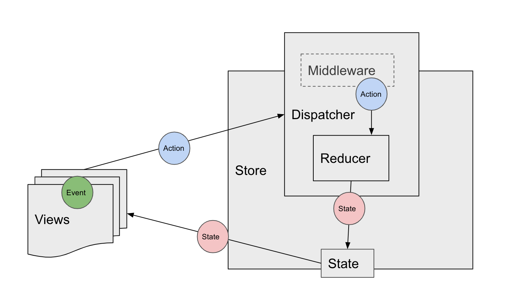

# kotlin-redux

[](https://travis-ci.com/github/Workday/kotlin-redux)

[](https://maven-badges.herokuapp.com/maven-central/com.workday/kotlin-redux)

This library is a simplified implementation of Redux written in Kotlin for Android. 

Redux is an architecture that was originally created in JavaScript: https://redux.js.org/. It follows a strict, unidirectional flow of data, and makes state predictable. It achieves this by ensuring the state is the single source of truth and immutable, and that changes to the state are done through pure functions.



## Installation

Add the following lines to your build.gradle file, replacing $kotlin_redux_version with latest version from Maven Central.

```
repositories {
    mavenCentral()
}

dependencies {
    compile "com.workday:kotlin-redux:$kotlin_redux_version"
}
```

## Usage
To create a state:

```
data class ExampleState(
    ...
) : State
```

You can have many reducers, but it is best practice to combine them into one. To create a reducer:

```
class ExampleReducer : Reducer<State, Action> {
    override fun invoke(currentState: State, newAction: Action): MainState {
        return currentState.copy(...)
    }
}
```

To create a single threaded store, use the following initialization but with your initial state, reducer, and middleware(s):

```
val store = SingleThreadedStore<MainState, Action>(
  state = ExampleState(...),
  reducer = ExampleReducer(),
  middleware = listOf(ExampleMiddleware(), AnotherMiddleware())
)
```

To subscribe to the store:

```
val storeUnsubscriber = store.subscribe { currentState, dispatch ->
  ...
}
```

Ensure that you also unsubscribe from the store by calling:

```
storeUnsubscriber.invoke()
```

Avoid dispatching multiple times in a row as per Redux best practices. To dispatch actions, use the following with an action that implements the `Action` interface:

```
dispatch(ExampleAction)
```

## Sample

See the sample app in the [sample](/sample) module for additional reference. The sample app is a simple counter, which shows a count and allows the user to increment and decrement the count.
